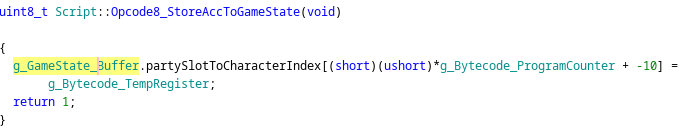

+++
title = 'Ghidra_lessons'
date = 2025-11-18T03:33:59-05:00
draft = false
+++

I've been doing a lot of reversing lately and learning a ton while doing it, I'm
going to try to document and maybe share some knowledge.

1. Segmented memory is really hard and the tools are bad. Unless you have good
   reason, stay away from x86 dos-era binaries using real mode. I will check back in on this in 5 years and see if the tooling has improved. A lot of games were ported to other platforms, so this can sometimes be avoided just by working on a different version of the same game.
2. Ghidra is really great and easily extensible. But it has some issues along
   with a steep learning curve.

Using a union with `uint8_t` (`byte`) array greatly helped improve decompilation output:

Before:

The `+ -10` part is because the `.partySlotToCharacterIndex` 

After:

A few other tips:

1. Start bottom up. Identify known functions and begin propagating types upwards. Even in old executables you will find plenty of system library calls that are used as the foundational building blocks of the program.

2. Make usage of the version control feature, and checkin regularly.

3. Use auto-analysis to propagate analyses after working on the program.

4. Use the diff tool to diff the results of auto-analysis. You can diff against the checked in version, but make sure you actually select the latest version rather than it from the listing. This is good to even see the results of various auto-analyses options.

5. The documentation is very good

6. LLMs seem to fair poorly with the output of the decompilation. It often has false positives, red herrings, etc., that they latch onto. On the other hand, the disassembly alone seems to be fine.

7. Massive majority of articles, plugins, and so on for Ghidra are related to malware analysis, vulnerability research, etc., 

8. Be careful of constants that happen to have the same address as pointers. This has bitten me a lot! 
